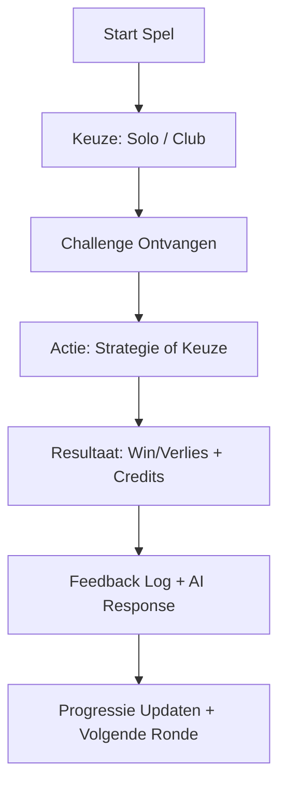

# 🎮 Bouwplan: Game "AI Club Clash" (Werknaam)

Een sociale, verslavende single/multiplayer game gekoppeld aan een zelflerende AI-agent & EA-platform.

---

## 🧱 1. Core Concept

**Doel:**
Spelers strijden solo of in clubs in snelle challenges. Ze verdienen credits, verzamelen feedback en trainen tegelijkertijd de AI/Economic Agent.

**Kenmerken:**

* Verslavende feedback-loop (snel spelen, direct belonen)
* Live hints en hulp via AI-chat
* Zelfgekozen spelersnamen (anoniem, geen echte namen)
* Progressie, leaderboards, rankings per club en speler
* Speldata voedt de EA-agent: wat werkt, wat niet

---

## 🧩 2. Gameplay Loop



---

## 🎯 3. Game Mechanics

| Onderdeel           | Uitleg                                                                             |
| ------------------- | ---------------------------------------------------------------------------------- |
| 🎲 **Challenges**   | Kleine snelle opdrachten: logica, strategie, tradingkeuzes, puzzels, reaction time |
| 💬 **AI-Hints**     | GPT helpt speler bij het maken van keuzes                                          |
| 🧠 **AI-Learning**  | Resultaten en keuzes worden gelogd en als feedback gebruikt                        |
| 🧩 **Mini-games**   | Reactie-opdrachten, keuzespellen, quiz                                             |
| 🏆 **Ranking & XP** | Spelers verdienen XP en credits                                                    |
| 👥 **Clubs**        | Teams van spelers (zelfgekozen naam) concurreren wekelijks                         |
| 🏁 **Seizoenen**    | Elke week een seizoen met prijsverdeling en reset van challenges                   |
| 🧾 **Economy**      | Spelers verdienen of kopen credits → nodig voor deelname aan events                |
| 🧠 **Data ➜ EA**    | Elke keuze + resultaat voedt een lesson voor de AI (via `game_feedback_loop.py`)   |

---

## 📱 4. Screens (Wireframes zijn al toegevoegd)

| Pagina          | Functie                             |
| --------------- | ----------------------------------- |
| **Home**        | Welkomstscherm, login/register      |
| **Login**       | Email/login, anonieme naam keuze    |
| **Gameroom**    | Huidige challenge, credits, tijd    |
| **AI-Chat**     | Realtime hulp en hints van de agent |
| **Shop**        | Credits kopen of beloningen claimen |
| **Clubroom**    | Chat met teamleden, clubprogressie  |
| **Leaderboard** | Rankings club/speler/AI-performance |

---

## 🧮 5. Backend Structuur (vereenvoudigd)

```plaintext
📁 backend/
├── routes/
│   ├── game.py              → Start challenge, verwerk keuzes
│   ├── ai_chat.py           → Koppeling met GPT
│   ├── feedback.py          → Lesson loggen
│   └── player.py            → Auth, profile, progress
├── models/
│   └── player, challenge, result, lesson
├── game_engine/
│   └── logic.py             → Challenge-generator, evaluator
├── game_feedback_loop.py    → Logica die leert van spelerdata
```

---

## 🗃️ 6. Database (vereenvoudigd)

| Tabel          | Velden                                       |
| -------------- | -------------------------------------------- |
| **Players**    | id, email, alias, xp, credits, club_id       |
| **Clubs**      | id, naam, leden, score                       |
| **Challenges** | id, type, inhoud, juiste oplossing           |
| **Results**    | player_id, challenge_id, uitkomst, tijd      |
| **Lessons**    | challenge_id, keuzes, outcomes, GPT-feedback |

---

## 📦 7. Technische Stack

| Onderdeel      | Tooling                                          |
| -------------- | ------------------------------------------------ |
| **Frontend**   | React (ShadCN / Tailwind), eventueel later Unity |
| **Backend**    | FastAPI + PostgreSQL                             |
| **AI**         | GPT-4 / fine-tuned model                         |
| **Dataflow**   | `game_feedback_loop.py` → EA-agent               |
| **Monitoring** | Streamlit dashboard / Grafana                    |
| **Login**      | JWT + email als username                         |

---

## 🎁 8. Belonings- & Creditsysteem

| Actie                      | Beloning                  |
| -------------------------- | ------------------------- |
| Challenge winnen           | 25–100 credits            |
| AI correct helpen          | + bonus 10                |
| Level up                   | XP + visueel effect       |
| Shop items kopen (visuals) | Met credits               |
| Extra lives / hints        | Credits / Ads (optioneel) |

---

## 🚀 9. Demo/Launch Strategie

| Stap                       | Beschrijving                                    |
| -------------------------- | ----------------------------------------------- |
| ✅ MVP Gameplay Loop        | simulate_gameplay.py, challenge router, credits |
| ✅ Wireframes + ERD         | docs toegevoegd                                 |
| 🔜 Frontend Demo           | React-componenten met dummy backend             |
| 🔜 Testfase met 50 testers | Feedback + EA-lering                            |
| 🔜 Public Launch           | Invite-only, leaderboard seizoen 1              |

---

## 🧠 10. Self-Learning AI Koppeling

Elke gespeelde ronde:

* Logt keuzes + resultaat
* AI beoordeelt of hulp correct was
* Lessons worden opgeslagen in `lessons.json`
* EA-agent past strategie/logica aan of herkent patronen

---

## 📂 Toevoegen aan project

Plaats dit plan als:

* `docs/game_script.md`
* Voeg het toe aan de README als: `📘 Game: speelmechaniek en design`
* Gebruik het als blueprint voor frontend + backend + AI-koppeling
